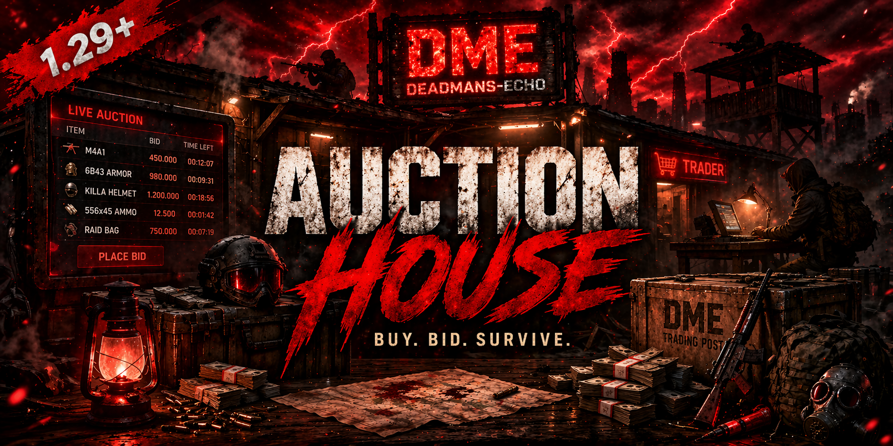

<p align="center">
  
</p>

<p align="center">
  
  
  
  
  <a href="LICENSE"></a>
</p>

<p align="center">
  
  
  
  
  
</p>

<p align="center">
  <b>A full-featured player-to-player auction house for DayZ</b><br>
  List items, place bids, buy instantly. Configurable currency, categories, fees and durations.<br>
  Built with Community Framework RPCs for reliable client-server communication.
</p>

<p align="center">
  <a href="https://deadmans-echo.de">
    
  </a>
</p>

---

## Features

<table>
<tr>
<td width="33%" valign="top">

### Marketplace
- Browse all active listings
- Search by item name
- Filter by category
- Sort by price, name or time
- Paginated results
- 3D item preview

</td>
<td width="33%" valign="top">

### Trading
- **Buy Now** - Fixed price, instant purchase
- **Auction** - Bidding with time limit
- **Hybrid** - Auction with Buy Now option
- Automatic bid reservation & refund
- Configurable minimum bid increment
- Listing & sale fee (economy sink)

</td>
<td width="33%" valign="top">

### Management
- **My Listings** - Track your active offers
- **My Bids** - See your current bids
- Cancel listings (if no bids)
- Offline sale notifications
- Pending pickup system
- Full transaction history

</td>
</tr>
</table>

---

## Currency System

The auction house supports three currency modes, configurable per server:

| Mode | Description | Dependency |
|------|-------------|------------|
| **Expansion** | Uses DayZ Expansion Market wallet + physical money. Supports ATM deposits for offline players. | DayZ Expansion |
| **Item** | Any in-game item as currency (e.g. `MoneyRuble100`, gold bars). Counted from player inventory. | None |
| **Internal** | Built-in points system. Balances stored in `PlayerData.json`. Fully standalone. | None |

```json
{
    "CurrencyType": "Expansion",
    "CurrencyItemClass": "MoneyRuble100"
}
```

---

## Access Points

Players interact with the auction house through placeable objects:

| Type | Class | Description |
|------|-------|-------------|
| **Terminal** | `DME_AH_AuctionTerminal` | Static object (desk, computer, kiosk). Place via admin tools. |
| **NPC** | `DME_AH_AuctionNPC` | Trader NPC. Non-hostile, non-lootable. Place via Expansion or admin tools. |

Both open the same auction menu via the `DME_AH_ActionOpenAuction` interact action.

---

## Server Configuration

All settings auto-generate on first run in `$profile:DME_AH/Config/`.

<details>
<summary><b>Settings.json</b> (click to expand)</summary>

```json
{
    "Enabled": true,
    "CurrencyType": "Expansion",
    "CurrencyItemClass": "MoneyRuble100",
    "MaxListingsPerPlayer": 10,
    "MaxActiveBidsPerPlayer": 20,
    "ListingFeePercent": 5,
    "SaleFeePercent": 10,
    "MinPrice": 1,
    "MaxPrice": 1000000,
    "AllowedDurations": [360, 720, 1440, 2880],
    "DefaultDuration": 1440,
    "MinBidIncrement": 1,
    "MinBidIncrementPercent": 5,
    "AutoSaveIntervalSeconds": 300,
    "MaxHistoryEntries": 500,
    "NotificationsEnabled": true,
    "DebugLogLevel": 3
}
```

| Setting | Description |
|---------|-------------|
| `ListingFeePercent` | Fee charged when creating a listing (non-refundable) |
| `SaleFeePercent` | Fee deducted from sale price on successful sale |
| `AllowedDurations` | Available durations in minutes (360=6h, 1440=24h, etc.) |
| `MinBidIncrementPercent` | Minimum bid increase as % of current bid |
| `AutoSaveIntervalSeconds` | How often data is auto-saved (also saves on every transaction) |
| `DebugLogLevel` | Controls log verbosity (see table below) |

**DebugLogLevel Values:**

| Level | Name | Description |
|-------|------|-------------|
| `0` | None | No log output at all. Use only when everything works and you want clean logs. |
| `1` | Error | Only critical errors (e.g. failed to load config, RPC failed, NPC spawn failed). |
| `2` | Warning | Errors + warnings (e.g. loadout item not found, currency fallback used). |
| `3` | **Info** (default) | Errors + warnings + operational info (startup, NPC spawned, listing created, transactions). Recommended for normal operation. |
| `4` | Debug | Everything including detailed debug output (every RPC call, action condition checks, bid refunds). Use for troubleshooting only - generates a lot of log output. |

</details>

<details>
<summary><b>Categories.json</b> (click to expand)</summary>

```json
{
    "Categories": [
        { "CategoryID": 1, "DisplayName": "Weapons", "Icon": "set:dayz_gui image:icon_weapon", "ClassFilters": [] },
        { "CategoryID": 2, "DisplayName": "Clothing", "Icon": "set:dayz_gui image:icon_clothing", "ClassFilters": [] },
        { "CategoryID": 3, "DisplayName": "Medical", "Icon": "set:dayz_gui image:icon_medical", "ClassFilters": [] },
        { "CategoryID": 4, "DisplayName": "Food", "Icon": "set:dayz_gui image:icon_food", "ClassFilters": [] },
        { "CategoryID": 5, "DisplayName": "Vehicles", "Icon": "set:dayz_gui image:icon_vehicle", "ClassFilters": [] },
        { "CategoryID": 6, "DisplayName": "Building", "Icon": "set:dayz_gui image:icon_build", "ClassFilters": [] },
        { "CategoryID": 7, "DisplayName": "Other", "Icon": "set:dayz_gui image:icon_gear", "ClassFilters": [] }
    ]
}
```

Add custom categories or use `ClassFilters` to restrict which items appear in each category.

</details>

---

## Installation

1. Copy `DME_Auction_House` folder to your DayZ server mods directory
2. Add `DME_Auction_House` to your server `-mod=` launch parameter
3. Ensure **Community Framework (CF)** is loaded
4. *(Optional)* Install **DayZ Expansion Market** if using Expansion currency
5. Start server - configs auto-generate in `$profile:DME_AH/`
6. Place `DME_AH_AuctionTerminal` or `DME_AH_AuctionNPC` objects on your map

---

## Architecture

```
CLIENT (5_Mission)                         SERVER (3_Game + 4_World)
+----------------------------------+       +----------------------------------+
| DME_AH_AuctionMenu              |       | DME_AH_Module (CF_ModuleWorld)   |
|   Tab: Marketplace               |       |   Config, DataStore, Logger      |
|   Tab: My Listings               | <---> |                                  |
|   Tab: My Bids                   |  CF   | DME_AH_AuctionManager            |
|   Tab: Sell Item                 | RPCs  |   Create, Buy, Bid, Cancel       |
+----------------------------------+       |   Expiry check (60s interval)    |
| DME_AH_DetailPanel               |       +----------------------------------+
| DME_AH_CreateListingDialog       |       | DME_AH_CurrencyAdapter           |
| DME_AH_ConfirmDialog             |       |   Expansion / Item / Internal    |
| DME_AH_NotificationHandler       |       +----------------------------------+
+----------------------------------+       | DME_AH_DataStore (JSON)          |
                                           |   ActiveListings, History,       |
                                           |   PlayerData, AutoSave           |
                                           +----------------------------------+
```

---

## Data Files

All persisted in `$profile:DME_AH/`:

| File | Content |
|------|---------|
| `Config/Settings.json` | Server configuration |
| `Config/Categories.json` | Category definitions |
| `Data/ActiveListings.json` | All active listings |
| `Data/CompletedListings.json` | Transaction history |
| `Data/PlayerData.json` | Internal balances & pending pickups |

---

## Localization

The mod ships with **English** and **German** translations in `stringtable.csv`. Add additional languages by extending the CSV columns.

---

## Dependencies

| Mod | Required | Purpose |
|-----|----------|---------|
| [Community Framework (CF)](https://steamcommunity.com/sharedfiles/filedetails/?id=1559212036) | **Yes** | RPC system, module lifecycle |
| [DayZ Expansion Market](https://steamcommunity.com/sharedfiles/filedetails/?id=2572331007) | No | Only needed if `CurrencyType` = `"Expansion"` |

---

## Credits

| | |
|---|---|
| **Author** | Psyern |
| **Community** | [Deadmans Echo](https://deadmans-echo.de) |
| **Engine** | DayZ Enfusion (EnforceScript) |
| **Target** | DayZ 1.29+ Experimental |

---

<p align="center">
  <sub>Built with EnforceScript for the DayZ modding community</sub><br>
  <sub>Made by <b>Psyern</b> for <b>Deadmans Echo</b></sub>
</p>
